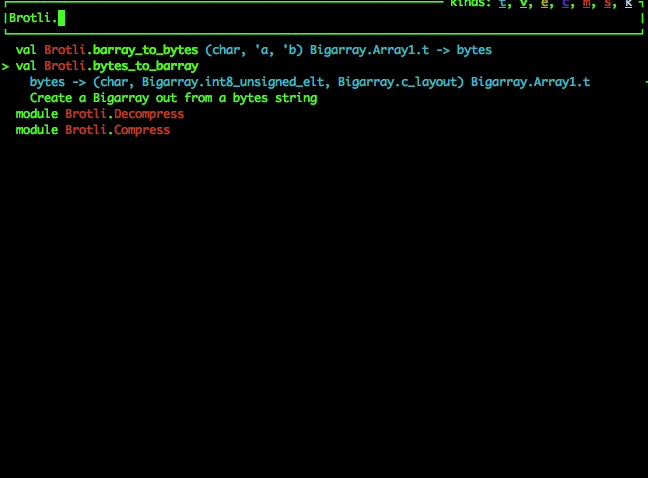

These are OCaml bindings to the compression algorithm/code released by
Google called [Brotli](https://github.com/google/brotli).

This library uses `Bigarrays` for memory efficiency and `Lwt` for
concurrency.

# Installation

I assume that you have [opam](https://opam.ocaml.org) installed, it is OCaml's package manager. 

```shell
$ opam install brotli
```

# Library usage

After compiling and installing you'll have one top level module called
`Brotli` available. This module contains two helper functions for
converting `Bytes` strings to `Bigarray~s and vice-verse. More
interesting are the two submodules ~Decompress` and `Compress`. You
can look at the well commented `mli` or you can look at this animation
which goes over the public API.



Decompressing is straightforward with not much wiggle room,
compression however can take a few parameters. You don't actually have
to pick any values though because the library defaults to the same
settings that Google picked in their Python bindings, but of course
you can override to your preferences.

# Issues

PRs and code reviews are always welcome and appreciated.

1.  I suck at `C++` so its maybe not the most idiomatic `C++` but it
    works.
2.  The build system relies on a `python` script, I wish it didn't.
